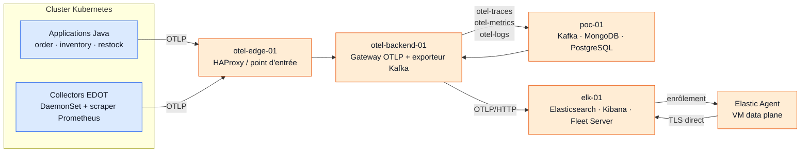
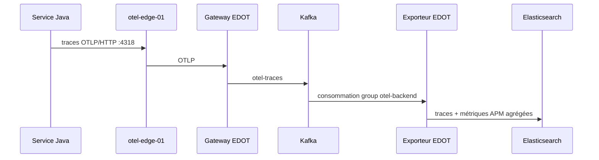
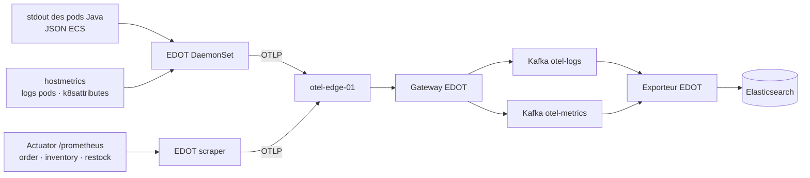
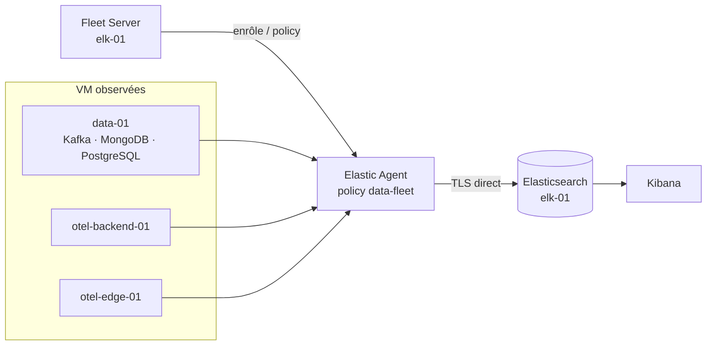
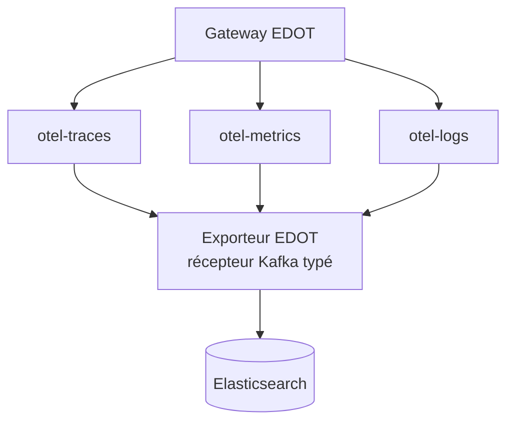

# Architecture

## Hybride Fleet

Observabilité des applications Java, de Kubernetes et des VM avec Elastic
Stack **9.4.3**

<div class="absolute bottom-8 left-10 text-sm opacity-70">POC SystemLens · 2026</div>

---

# Une architecture hybride, deux chemins maîtrisés

<div class="grid grid-cols-2 gap-8 mt-8">

<div class="border-2 border-blue-400 rounded-xl p-6">

### Applications & Kubernetes

**OpenTelemetry / EDOT + Kafka**

- traces Java via OTLP ;
- logs stdout et métriques Kubernetes ;
- buffer Kafka séparé par signal ;
- export final vers Elasticsearch.

</div>

<div class="border-2 border-orange-400 rounded-xl p-6">

### VM de données

**Elastic Agent enrôlé dans Fleet**

- logs et métriques système ;
- intégrations Kafka, MongoDB et PostgreSQL ;
- publication directe vers Elasticsearch ;
- pilotage centralisé par Fleet Server.

</div>

</div>

<div class="mt-8 text-center text-xl">Kafka reste le tampon de télémétrie du cluster — pas celui des VM.</div>

---

# Topologie de déploiement



<div class="text-sm opacity-70 mt-4">otel-edge-01 est le seul point d’entrée exposé ; elk-01 porte le stockage et la consultation.</div>

---

# Flux applicatif : traces et métriques



- L’agent Java est injecté par init container.
- Le contexte `trace.id` / `span.id` permet la corrélation avec les logs.
- Les métriques applicatives sont scrappées sur `/actuator/prometheus` toutes les 15 s.
- L’export métrique de l’agent Java est désactivé pour éviter les doublons.

---

# Flux logs et métriques Kubernetes



Le parsing du JSON ECS et l’enrichissement Kubernetes sont réalisés avant le
buffer. L’exporteur remappe les identifiants de trace vers les champs ECS.

---

# Flux VM : Fleet en direct



<div class="grid grid-cols-3 gap-4 mt-6 text-center">
<div class="rounded-lg bg-orange-100 p-3">System</div>
<div class="rounded-lg bg-orange-100 p-3">Kafka</div>
<div class="rounded-lg bg-orange-100 p-3">MongoDB · PostgreSQL</div>
</div>

<div class="mt-5 text-center">Les VM n’écrivent ni dans <code>otel-logs</code> ni dans <code>otel-metrics</code>.</div>

---

# Pourquoi séparer les topics Kafka ?



| Signal | Topic | Traitement notable |
| --- | --- | --- |
| Traces | `otel-traces` | enrichissement APM |
| Métriques | `otel-metrics` | export infrastructure et APM |
| Logs | `otel-logs` | corrélation ECS `trace.id` / `span.id` |

La séparation évite les erreurs de décodage du receiver Kafka OTLP et rend la
backpressure observable par signal.

---

# Exploitation : une chaîne vérifiable

<div class="grid grid-cols-2 gap-8 mt-6">

<div>

### Déclarer

- Kustomize : `architecture/platform/kubernetes/` ;
- Ansible / Quadlet : `architecture/ansible/` ;
- policy Fleet et dashboards : `architecture/platform/elk/`.

</div>

<div>

### Contrôler

```bash
make kubernetes-validate
make -C architecture ansible-validate
make -C architecture otel-validation
make -C architecture dashboards-verify
```

</div>

</div>

<div class="mt-8 p-5 rounded-xl bg-slate-100">

**Résultat attendu :** manifests rendus, playbook syntaxiquement valide,
endpoints OTLP joignables et données visibles dans Kibana.

</div>

---

# À retenir

<div class="text-2xl leading-relaxed mt-8">

1. **Un point d’entrée** : `otel-edge-01` simplifie l’exposition OTLP et TLS.
2. **Un buffer ciblé** : Kafka découple les signaux du cluster.
3. **Une gestion VM native Elastic** : Fleet centralise les agents et les intégrations.
4. **Une destination commune** : Elasticsearch et Kibana corrèlent traces, logs et métriques.
5. **Une architecture IaC** : chaque raccordement est décrit et validable dans le dépôt.

</div>

<div class="absolute bottom-8 right-10 text-sm opacity-70">Sources : architecture/README.md · architecture/platform/elk · architecture/platform/kubernetes · architecture/ansible</div>
