<style>
.slidev-layout .mermaid {
  width: 116%;
  transform: scale(0.75);
  transform-origin: top center;
  margin-bottom: -92px;
}
</style>

# Remonter les signaux vers Elastic

## Une architecture pragmatique pour les applications et l’infrastructure

Applications Java, Kubernetes, systèmes, Kafka, MongoDB et PostgreSQL

<div class="absolute bottom-8 left-10 text-sm opacity-70">Revue d’architecture SRE · POC SystemLens · 2026</div>

---

# Plan de la revue

<div class="grid grid-cols-2 gap-5 mt-8 text-left">

<div class="rounded-xl border-l-8 border-blue-500 bg-blue-50 p-5">
<div class="text-sm font-semibold text-blue-700">01 · Comprendre</div>
<div class="mt-1 text-xl font-semibold">Objectif et périmètre</div>
<div class="mt-2 text-sm">Sources observées, signaux attendus et critères de réussite.</div>
</div>

<div class="rounded-xl border-l-8 border-indigo-500 bg-indigo-50 p-5">
<div class="text-sm font-semibold text-indigo-700">02 · Acheminer</div>
<div class="mt-1 text-xl font-semibold">Architecture et chemins</div>
<div class="mt-2 text-sm">EDOT, Collecteur Edge, Kafka, Backend et Elasticsearch.</div>
</div>

<div class="rounded-xl border-l-8 border-emerald-500 bg-emerald-50 p-5">
<div class="text-sm font-semibold text-emerald-700">03 · Observer</div>
<div class="mt-1 text-xl font-semibold">Logs, métriques et traces</div>
<div class="mt-2 text-sm">Ce que chaque famille de signaux apporte au diagnostic.</div>
</div>

<div class="rounded-xl border-l-8 border-amber-500 bg-amber-50 p-5">
<div class="text-sm font-semibold text-amber-700">04 · Exploiter</div>
<div class="mt-1 text-xl font-semibold">Déploiement et contrôle</div>
<div class="mt-2 text-sm">IaC, topologie, responsabilités et vérifications reproductibles.</div>
</div>

<div class="rounded-xl border-l-8 border-fuchsia-500 bg-fuchsia-50 p-5">
<div class="text-sm font-semibold text-fuchsia-700">05 · Prouver</div>
<div class="mt-1 text-xl font-semibold">Kibana et APM</div>
<div class="mt-2 text-sm">Dashboards OTel, service Java, inventaire et corrélation.</div>
</div>

<div class="rounded-xl border-l-8 border-slate-500 bg-slate-50 p-5">
<div class="text-sm font-semibold text-slate-700">06 · Décider</div>
<div class="mt-1 text-xl font-semibold">Bilan et évolutions</div>
<div class="mt-2 text-sm">Compromis validés, limites connues et prochaines étapes.</div>
</div>

</div>

<div class="mt-7 text-center text-lg font-medium">Un fil conducteur : de la source au diagnostic vérifiable.</div>

---

# Décision attendue

L’architecture proposée couvre les sources du POC en combinant OpenTelemetry / EDOT
et Elastic Agent, avec un chemin d’exploitation vérifiable dans Elastic.

<div class="grid grid-cols-3 gap-5 mt-10">

<div class="rounded-xl bg-blue-100 p-5">

### Couverture

Logs, métriques, traces et APM pour les applications Java et l’infrastructure.

</div>

<div class="rounded-xl bg-emerald-100 p-5">

### Simplicité

Un collecteur adapté à chaque famille de sources, avec des responsabilités lisibles.

</div>

<div class="rounded-xl bg-orange-100 p-5">

### Vérifiabilité

Chaque flux possède un transport, une destination et un contrôle observable.

</div>

</div>

<div class="mt-10 text-xl">La question est de valider le compromis, pas de choisir un collecteur unique par principe.</div>

---

# Périmètre observé

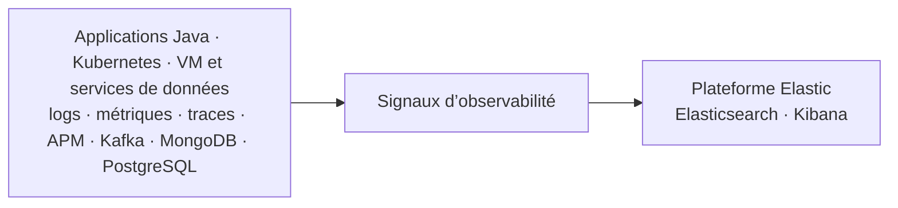

<div class="grid grid-cols-2 gap-6 mt-8 text-left">

<div class="border-2 border-blue-400 rounded-xl p-5">

**Applications et Kubernetes** : rester proche d’OpenTelemetry, conserver la
corrélation et utiliser Kafka comme tampon des signaux du cluster.

</div>

<div class="border-2 border-orange-400 rounded-xl p-5">

**VM et intégrations** : réduire la configuration spécifique en utilisant
Elastic Agent EDOT standalone, configuré par Ansible et exportant en OTLP vers
le Collecteur Edge.

</div>

</div>

---

# 1. Logs : rendre les événements consultables

Le premier besoin est de collecter les événements sans perdre leur contexte.

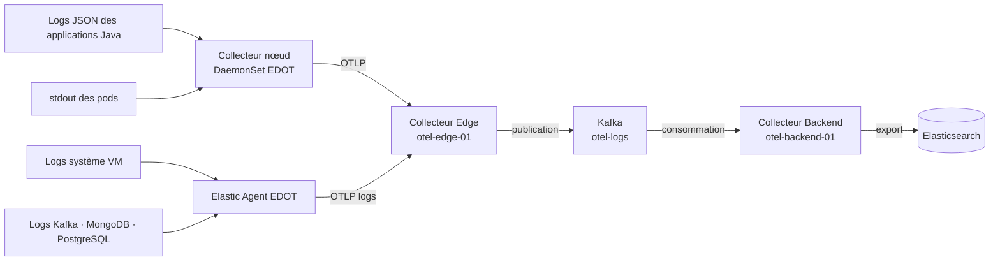

- Les logs applicatifs restent corrélables avec `trace.id` et `span.id`.
- Les logs Kubernetes sont enrichis avec le contexte du pod et du namespace.
- Les logs des VM et des services de données sont collectés par Elastic Agent
  EDOT, installé et configuré par Ansible.

<div class="mt-3 rounded-xl bg-slate-100 p-3 text-center text-sm">Preuve attendue : événements visibles dans Kibana avec source, hôte, namespace et contexte de corrélation.</div>

---

# Logs applicatifs et Kubernetes

<div class="grid grid-cols-2 gap-8 mt-8">

<div>

### Collecte

- Les services Java écrivent des logs JSON au format ECS.
- Le Collecteur nœud (DaemonSet) lit les sorties des pods.
- `k8sattributes` ajoute le contexte Kubernetes.

</div>

<div>

### Chemin

- EDOT envoie les événements en OTLP.
- Le Collecteur Edge les route vers `otel-logs`.
- Le Collecteur Backend consomme Kafka et exporte vers Elasticsearch.

</div>

</div>

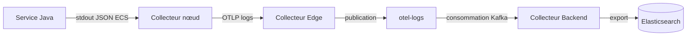

<div class="mt-3 text-center text-base">Le format et les identifiants de corrélation sont préparés avant le buffer.</div>

---

# Logs d’infrastructure et des services de données

L’Elastic Agent complète la couverture lorsque la source est une VM ou une
intégration Elastic existante.

| Source | Collecte | Destination |
| --- | --- | --- |
| Système des VM | Elastic Agent EDOT standalone | Collecteur Edge, Kafka, Backend, Elasticsearch |
| Kafka | Elastic Agent EDOT standalone | Collecteur Edge, Kafka, Backend, Elasticsearch |
| MongoDB | Elastic Agent EDOT standalone | Collecteur Edge, Kafka, Backend, Elasticsearch |
| PostgreSQL | Elastic Agent EDOT standalone | Collecteur Edge, Kafka, Backend, Elasticsearch |

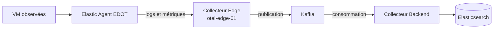

<div class="mt-4 p-3 rounded-xl bg-orange-100 text-sm">L’Elastic Agent des VM envoie ses logs et métriques au Collecteur Edge. Ces données suivent ensuite Kafka et le Collecteur Backend avant leur indexation dans Elasticsearch.</div>

---

# 2. Métriques : mesurer l’état et la capacité

Les métriques combinent les mesures applicatives, Kubernetes et système.

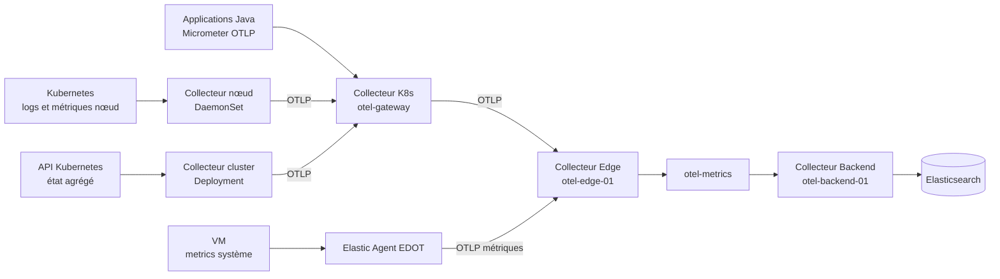

<div class="text-sm leading-tight">

- Les métriques applicatives sont exportées en OTLP par Micrometer.
- Les métriques Kubernetes et hôte sont collectées par le Collecteur nœud ; le
  Collecteur cluster publie l’état agrégé via l’API Kubernetes.
- Les métriques VM et services de données sont collectées par Elastic Agent
  EDOT selon la configuration déclarée pour les VM.

</div>

<div class="mt-2 rounded-xl bg-slate-100 p-2 text-center text-xs">Preuve attendue : séries applicatives et infrastructure consultables avec leurs dimensions utiles.</div>

---

# Métriques applicatives et Kubernetes

<div class="grid grid-cols-2 gap-8 mt-8">

<div class="border-2 border-blue-400 rounded-xl p-5">

### Applications Java

Les services `order-service`, `inventory-service` et `restock-service` exportent
leurs métriques Micrometer en OTLP vers `otel-gateway`.

</div>

<div class="border-2 border-blue-400 rounded-xl p-5">

### Cluster Kubernetes

Le Collecteur nœud et le Collecteur cluster collectent les métriques des pods,
des nœuds et de l’état agrégé, puis les transmettent à `otel-gateway`.

</div>

</div>

<div class="mt-8 text-center">

Les métriques APM produites par l’agent Java ne sont pas exportées en double :
Micrometer OTLP reste le point de référence pour les métriques applicatives.

</div>

---

# Preuve Kibana : Kubernetes OTel

Le dashboard expose l’état du cluster, la santé des nœuds et les séries de CPU,
mémoire et disque produites par la collecte OTel.

<div class="mt-6 text-center">
  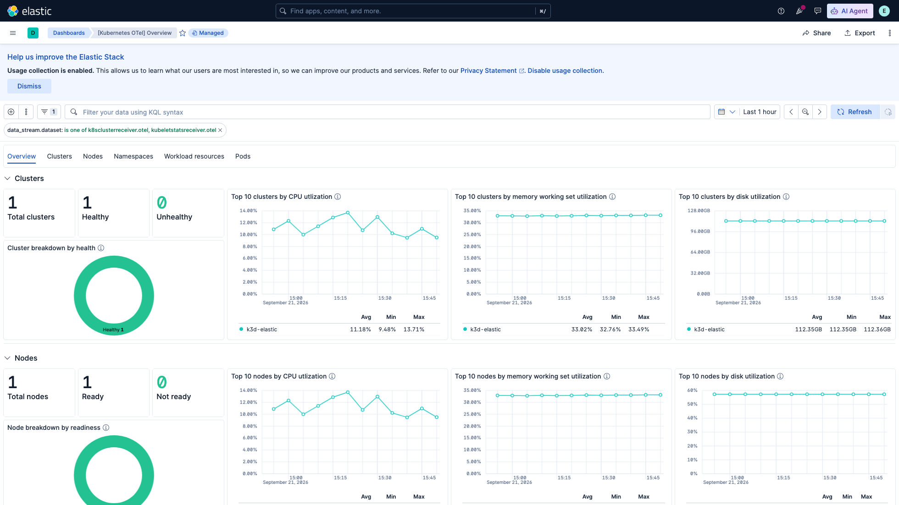
</div>

---

# 3. Traces et APM : suivre une transaction

Les traces Java restent sur le chemin OpenTelemetry / OTLP, avec un buffer Kafka
séparé et une exportation vers les données APM Elastic.

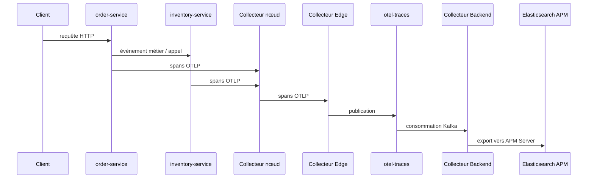

- L’agent Java est injecté dans les services et conserve les noms de service et d’environnement.
- Les événements Kafka rendent visible le fan-out entre commande, stock et réassort.
- Les identifiants de trace permettent de retrouver les logs associés.

<div class="mt-6 rounded-xl bg-slate-100 p-4 text-center">Preuve attendue : une trace distribuée, ses spans et les logs portant le même `trace.id`.</div>

---

# Preuve Kibana : APM des services Java

La vue APM confirme la présence des trois services applicatifs et fournit leur
débit, leur latence et leur taux d’échec pour poursuivre le diagnostic.

<div class="mt-6 text-center">
  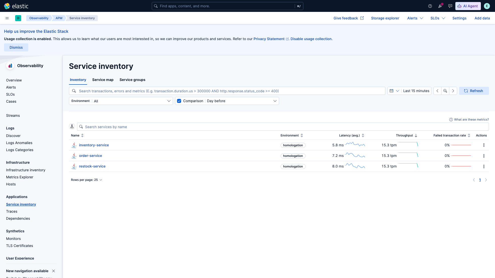
</div>

---

# Corrélation : passer du signal au diagnostic

La valeur opérationnelle vient de la navigation entre signaux, pas de leur
stockage séparé.

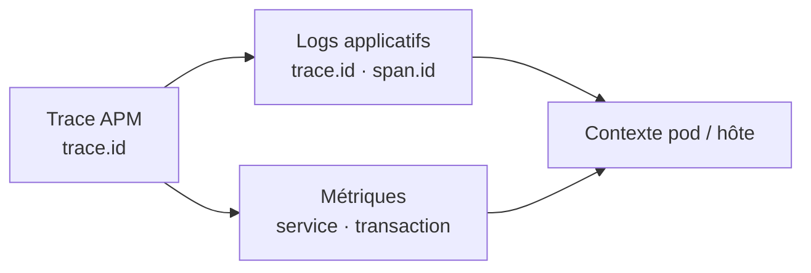

<div class="grid grid-cols-3 gap-5 mt-10 text-center">

<div class="rounded-xl bg-blue-100 p-5">Identifier la transaction lente</div>
<div class="rounded-xl bg-emerald-100 p-5">Retrouver les événements associés</div>
<div class="rounded-xl bg-orange-100 p-5">Relier l’impact à l’infrastructure</div>

</div>

<div class="mt-8 text-center">La recette Kibana devra vérifier ces trois navigations sur un même scénario métier.</div>

---

# Pourquoi deux chemins de collecte ?

Les chemins sont séparés par responsabilité, pas par signal.

| Famille de sources | Collecteur | Transport | Usage |
| --- | --- | --- | --- |
| Applications Java | Agent Java, Micrometer et Gateway OTLP | OTLP puis Kafka | Traces, logs et métriques applicatives |
| Kubernetes | Collecteur nœud, Collecteur cluster et Gateway | OTLP puis Kafka | Logs, pods, nœuds et métriques de cluster |
| VM et services de données | Elastic Agent EDOT standalone | OTLP vers Edge puis Kafka | Système, Kafka, MongoDB et PostgreSQL |

<div class="grid grid-cols-2 gap-8 mt-8">

<div class="border-2 border-blue-400 rounded-xl p-5">

**Fil directeur** : OpenTelemetry / OTLP pour les signaux produits par les
applications et le cluster.

</div>

<div class="border-2 border-orange-400 rounded-xl p-5">

**Simplification** : Elastic Agent EDOT standalone pour les VM et les services
de données, avec une configuration déclarative Ansible/Kustomize et sans OpAMP.

</div>

</div>

---

# Une chaîne déclarative et contrôlable

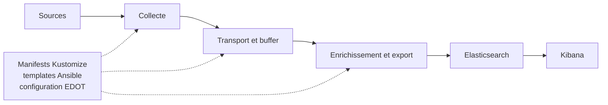

Contrôles disponibles depuis la racine :

```bash
make architecture-status
make kubernetes-validate
make ansible-validate
make otel-validation
make dashboards-verify
```

<div class="mt-6 text-center text-lg">Une évolution durable doit être déclarée dans le dépôt puis vérifiée sur le chemin observable.</div>

---

# Topologie complète

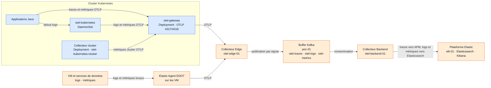

<div class="mt-6 text-center">Kafka tamponne les signaux. Le plan de données passe par Edge, Kafka et Backend ; les collecteurs sont configurés par IaC.</div>

---

# Déploiements vérifiés

Les manifests et rôles de provisionnement confirment la répartition suivante.

<div class="text-sm leading-tight mt-4">

| Périmètre | Déploiement vérifié | Fonction |
| --- | --- | --- |
| Kubernetes | `otel-kubernetes` DaemonSet | Logs stdout, métriques hôte, kubelet et pods |
| Kubernetes | Collecteur cluster (`otel-kubernetes-cluster`) | État agrégé du cluster |
| Kubernetes | `otel-gateway` Deployment et Service | Réception OTLP sur `4317` et `4318` |
| `otel-edge-01` | Collecteur EDOT et HAProxy | Entrée OTLP et publication Kafka |
| `poc-01` | Kafka | Topics `otel-traces`, `otel-logs`, `otel-metrics` |
| `otel-backend-01` | Exporteur EDOT Kafka | Export vers APM Server / Elasticsearch |
| `elk-01` | Elasticsearch, Kibana et APM Server | Stockage et consultation |

</div>

Les collecteurs Kubernetes sont configurés par Kustomize. Le chemin des
signaux reste Gateway, Edge, Kafka, Backend et Elastic.

---

# Preuve Kibana : agents Fleet

Fleet rend observable l’état des agents qui collectent les logs et métriques
des VM et des services de données.

<div class="mt-6 text-center">
  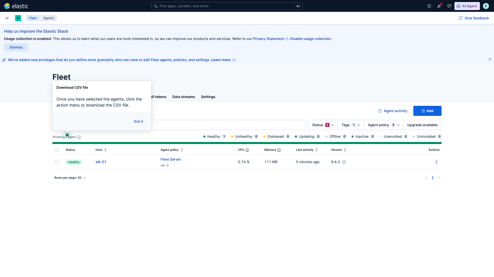
</div>

---

# Recette de validation

La validation finale doit suivre un scénario métier de bout en bout.

<div class="grid grid-cols-4 gap-4 mt-8 text-center">

<div class="rounded-xl bg-blue-100 p-4">1. Déclencher une commande</div>
<div class="rounded-xl bg-emerald-100 p-4">2. Suivre la trace</div>
<div class="rounded-xl bg-orange-100 p-4">3. Retrouver les logs</div>
<div class="rounded-xl bg-violet-100 p-4">4. Vérifier les métriques</div>

</div>

| Vérification | Résultat attendu |
| --- | --- |
| Logs Java et Kubernetes | source et contexte enrichis |
| Logs système et intégrations | données visibles dans les data streams Elastic |
| Métriques | séries applicatives et infrastructure présentes |
| APM | trace distribuée et services associés |
| Corrélation | navigation par `trace.id` et `span.id` |

<div class="mt-5 text-center text-sm opacity-70">Les captures ci-dessous montrent les preuves Kibana obtenues sur le cluster actif.</div>

---

# Preuve Kibana : dashboard System OTel

Ouvrir **[OTel] Host Details - Metrics** avec une fenêtre temporelle de 15 minutes :
les métriques sont issues de `metrics-hostmetricsreceiver.otel-*`.

<div class="mt-6 text-center">
  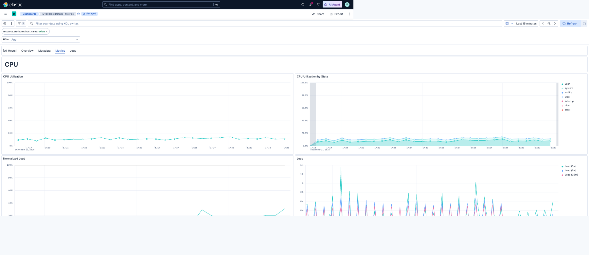
</div>

---

# Preuve Kibana : dashboard PostgreSQL OTel

Ouvrir **[PostgreSQL OTel] Overview** avec une fenêtre temporelle de 15 minutes.
Les données proviennent de `metrics-postgresqlreceiver.otel-*`.

<div class="mt-6 text-center">
  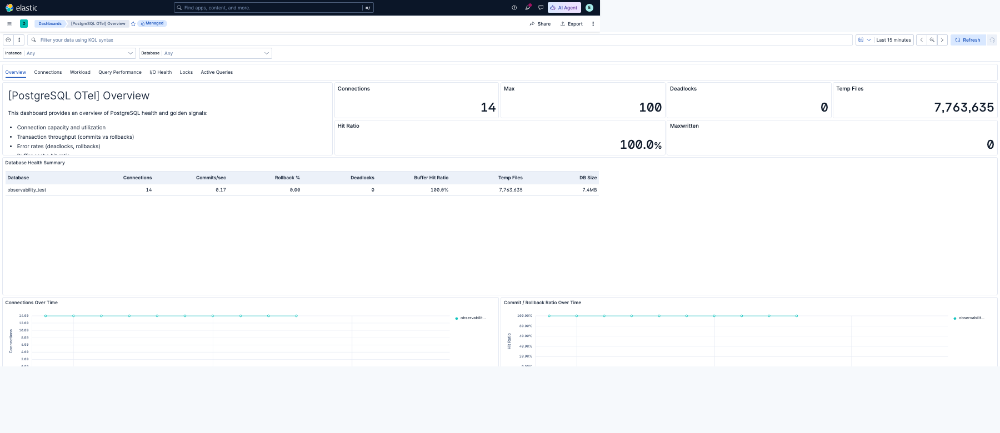
</div>

---

# Preuve Kibana : dashboard Kafka OTel

Ouvrir **[Kafka OTel] Overview** avec une fenêtre temporelle de 15 minutes.
Les données proviennent de `metrics-kafkametricsreceiver.otel-*`.

<div class="mt-6 text-center">
  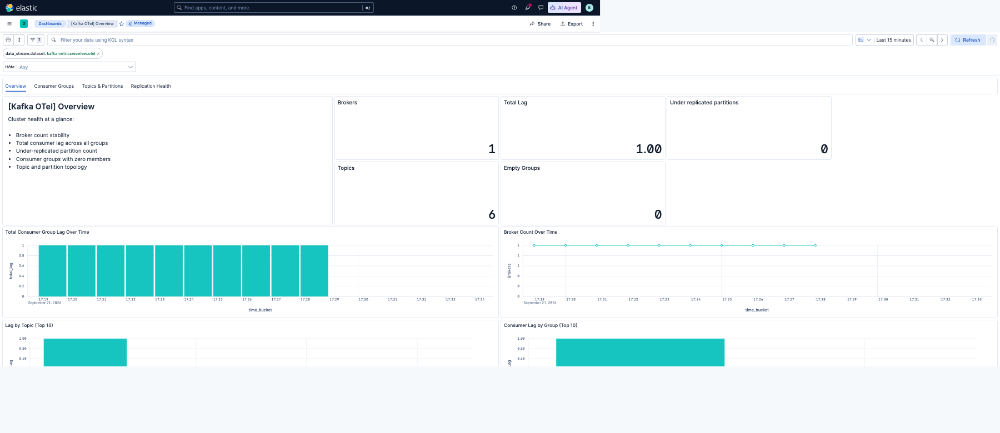
</div>

---

# Preuve Kibana : dashboard MongoDB OTel

Ouvrir **[MongoDB OTel] Overview** avec une fenêtre temporelle de 15 minutes.
Les données proviennent de `metrics-mongodbreceiver.otel-*`.

<div class="mt-6 text-center">
  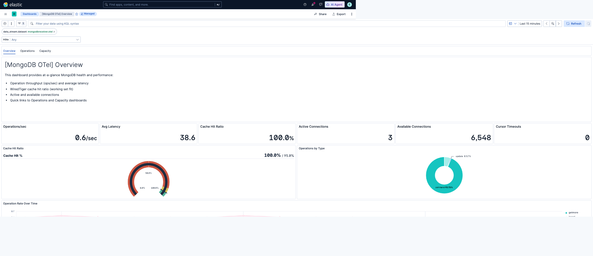
</div>

---

# Preuve Kibana : service Java dans APM

La vue détaillée de **`order-service`** expose directement la latence, le débit,
les transactions HTTP et le taux d’échec du service Java.

<div class="mt-6 text-center">
  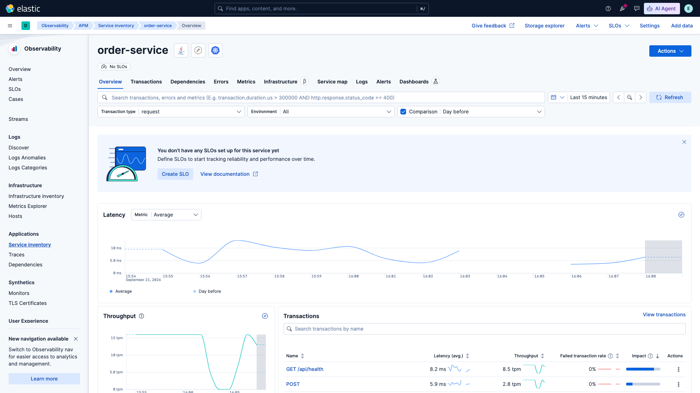
</div>

---

# Trajectoire d’évolution

L’architecture actuelle reste volontairement pragmatique.

<div class="grid grid-cols-3 gap-5 mt-10">

<div class="rounded-xl bg-slate-100 p-5">

### Maintenant

Deux chemins lisibles, avec une couverture complète et des contrôles associés.

</div>

<div class="rounded-xl bg-blue-100 p-5">

### Ensuite

Suivre la roadmap Elastic et réévaluer les capacités communes de collecte,
d’intégration et d’export.

</div>

<div class="rounded-xl bg-emerald-100 p-5">

### Condition

Uniformiser uniquement si cela réduit réellement la charge opérationnelle sans
réduire la couverture.

</div>

</div>

<div class="mt-10 text-center text-xl">L’uniformisation est une piste long terme, pas une contrainte de validation de la première version.</div>

---

# Décisions à valider

<div class="text-lg leading-relaxed mt-6">

1. Les applications Java et Kubernetes restent sur le chemin OpenTelemetry / EDOT avec Kafka.
2. Les VM, Kafka, MongoDB et PostgreSQL sont couverts par Elastic Agent EDOT standalone.
3. Les trois signaux sont séparés dans Kafka pour préserver un traitement explicite.
4. La validation se fait par la chaîne complète : source, collecte, transport, Elasticsearch et Kibana.
5. L’uniformisation future dépend des capacités apportées par la roadmap Elastic.

</div>

<div class="mt-6 p-4 rounded-xl bg-slate-100 text-center text-lg">Objectif de la revue : valider ce périmètre et identifier les contrôles manquants avant d’aller plus loin.</div>

<div class="absolute bottom-8 right-10 text-sm opacity-70">Sources : architecture/ · docs/architecture.md · manifests Kubernetes · configuration IaC</div>
