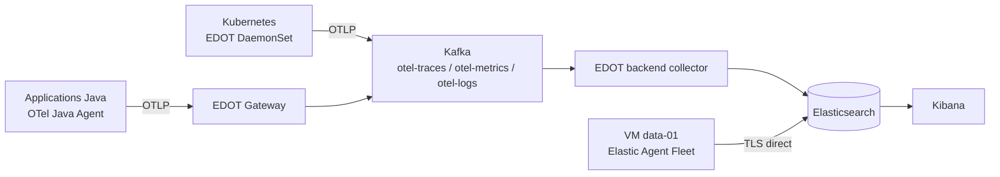

# Architectures v1, v2 et v3

La v3 repart de la structure v2. Elle conserve le transport OpenTelemetry et
le tampon Kafka pour les applications Java et la collecte Kubernetes. Elle
remplace uniquement le chemin VM EDOT → Kafka par un Elastic Agent enrôlé dans
Fleet, qui écrit directement dans Elasticsearch.

## Flux v3



## Responsabilités

| Périmètre | v1 | v2 | v3 |
| --- | --- | --- | --- |
| Traces applicatives | APM Agent → APM Server → Logstash | OTel → EDOT → Kafka → EDOT | OTel → EDOT → Kafka → EDOT |
| Logs applicatifs | Elastic Agent Kubernetes → Logstash | EDOT DaemonSet → Kafka → EDOT | EDOT DaemonSet → Kafka → EDOT |
| Logs et métriques VM | Filebeat/Metricbeat → Logstash | EDOT Agent → Kafka → EDOT | Elastic Agent Fleet → Elasticsearch |
| Gestion des VM | Ansible + Beats | Ansible + EDOT standalone | Ansible + enrôlement Fleet |
| Rôle de Kafka | Source observée | Buffer de télémétrie | Buffer applicatif/Kubernetes uniquement |

Les noms courts utilisés dans les commandes sont donc : **v1 — Elastic
classique**, **v2 — OpenTelemetry + Kafka** et **v3 — Hybride Fleet**.

## Déploiement et vérification

Prérequis : cluster k3d, ECK, Vagrant, Ansible, accès HTTPS au registre Elastic
et `POSTGRESQL_PASSWORD` fourni hors Git. Après le déploiement de la plateforme,
le jeton Fleet est créé à la volée ; il n'est ni versionné ni affiché.

```bash
make architecture-switch VERSION=v3
make kubernetes-validate
make deploy
```

Charger ensuite les credentials avec `source ./v3/platform/elk/scripts/load-credentials.sh`
une fois Elasticsearch accessible.

Contrôles attendus :

```bash
kubectl -n elastic-stack get deployment otel-gateway otel-kafka-exporter
vagrant ssh data-01 -c 'sudo systemctl is-active elastic-agent'
make dashboards-verify
```

Les traces et logs applicatifs suivent les data streams OTLP de la v2, tandis
que les logs et métriques VM sont associés à l'agent Fleet et à
`host.name: data-01`. `otel-logs` et `otel-metrics` ne doivent plus contenir
les événements produits par la VM.
