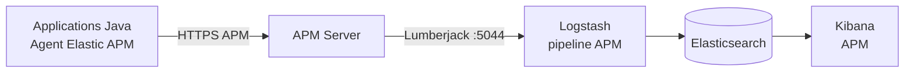
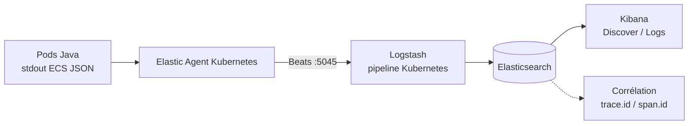
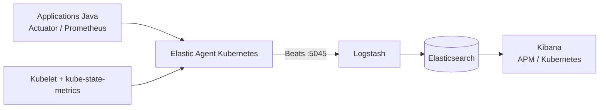
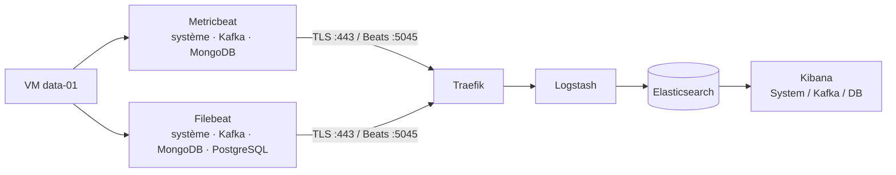
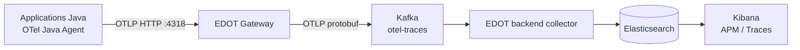
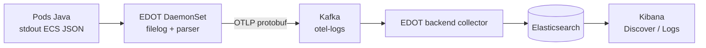
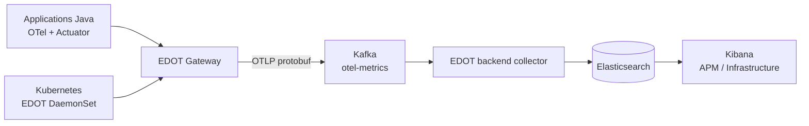
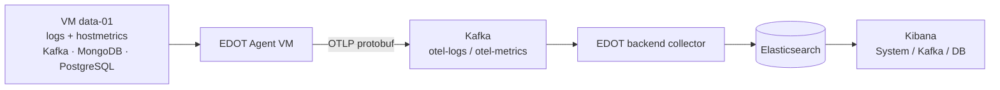
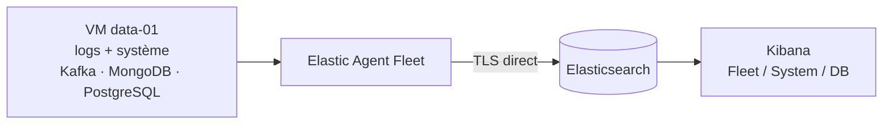

# Architectures v1, v2 et v3

Ce document décrit les trois architectures avec la même grille de lecture.
Chaque architecture présente successivement les traces applicatives, les logs
applicatifs et Kubernetes, les métriques applicatives et Kubernetes, puis les
logs et métriques des VM.

Les noms courts sont : **v1 — Elastic classique**, **v2 — OpenTelemetry +
Kafka** et **v3 — Hybride Fleet**. Une seule architecture doit être active à
la fois dans les namespaces communs `elastic-stack` et
`h0tl-supermarche-app`.

La gestion détaillée du débit, des quotas, du sampling et de la backpressure est
décrite dans le [guide de gestion du débit](gestion-du-debit-observabilite.md).

## v1 — Elastic classique

### Traces applicatives



L'agent Elastic APM instrumente les services Java et transmet les traces et
les métriques APM à APM Server. Logstash les route vers Elasticsearch.

### Logs applicatifs et Kubernetes



Elastic Agent collecte les logs stdout des pods, ajoute le contexte Kubernetes
et les transmet à Logstash. Les champs ECS permettent la corrélation avec les
traces APM.

### Métriques applicatives et Kubernetes



Les métriques Prometheus de l'application, les métriques kubelet et l'état
Kubernetes sont collectés par Elastic Agent puis routés par Logstash.

### Logs et métriques des VM



Metricbeat collecte les métriques et Filebeat les logs locaux. Kafka est une
source observée ; il ne sert pas de tampon de télémétrie.

## v2 — OpenTelemetry + Kafka

### Traces applicatives



Le Gateway applique `elasticapm` pour produire les métriques APM agrégées.
Les traces et ces métriques suivent ensuite le buffer Kafka.

### Logs applicatifs et Kubernetes



Le DaemonSet lit stdout, normalise `trace_id` et `span_id` vers `trace.id` et
`span.id`, puis publie les logs dans Kafka. L'agent Java n'exporte pas les logs.

### Métriques applicatives et Kubernetes



Les métriques Java, hôte et Kubernetes suivent le topic `otel-metrics`. La v2
ne couvre pas l'état Kubernetes complet via `kube-state-metrics`.

### Logs et métriques des VM



L'EDOT Agent local collecte les logs et métriques techniques, puis les publie
dans Kafka. Kafka fournit le buffer avant l'export Elasticsearch.

## v3 — Hybride Fleet

### Traces applicatives


Le flux de traces v3 est identique à celui de v2 : le Gateway et le Collector
backend conservent l'enrichissement APM et le buffer Kafka.

### Logs applicatifs et Kubernetes


Le flux de logs applicatifs et Kubernetes v3 est identique à celui de v2. Les
logs VM n'empruntent toutefois pas ce topic.

### Métriques applicatives et Kubernetes


Les métriques applicatives et Kubernetes v3 conservent le pipeline v2 et ses
topics OTLP. Kafka reste utilisé pour ces flux.

### Logs et métriques des VM



L'Elastic Agent est installé par Ansible et enrôlé dans la policy `data-fleet`.
Les intégrations System, Kafka, MongoDB et PostgreSQL envoient directement les
événements vers Elasticsearch. La VM ne publie pas dans `otel-logs` ou
`otel-metrics`.

## Comparaison synthétique

| Flux | v1 — Elastic classique | v2 — OpenTelemetry + Kafka | v3 — Hybride Fleet |
| --- | --- | --- | --- |
| Traces applicatives | APM Agent → APM Server → Logstash | OTel → EDOT → Kafka → EDOT | OTel → EDOT → Kafka → EDOT |
| Logs applicatifs/Kubernetes | Elastic Agent → Logstash | EDOT DaemonSet → Kafka → EDOT | EDOT DaemonSet → Kafka → EDOT |
| Métriques applicatives/Kubernetes | Elastic Agent → Logstash | OTel/EDOT → Kafka → EDOT | OTel/EDOT → Kafka → EDOT |
| Logs et métriques VM | Filebeat/Metricbeat → Logstash | EDOT Agent → Kafka → EDOT | Elastic Agent Fleet → Elasticsearch |
| Gestion VM | Ansible + Beats | Ansible + EDOT standalone | Ansible + enrôlement Fleet |
| Rôle de Kafka | Source observée | Buffer de télémétrie | Buffer applicatif/Kubernetes uniquement |

## Déploiement et vérification

Prérequis : cluster k3d, ECK, Vagrant, Ansible, accès HTTPS au registre Elastic
et `POSTGRESQL_PASSWORD` fourni hors Git. Sélectionner une architecture avant
le déploiement :

```bash
make architecture-list
make architecture-switch VERSION=v3
make kubernetes-validate
make deploy
```

Pour v3, `make deploy` crée le socle Kubernetes, génère un jeton Fleet
temporaire et enrôle `data-01`. Après le premier déploiement, charger les
credentials avec `source ./v3/platform/elk/scripts/load-credentials.sh`.

Contrôles v3 :

```bash
kubectl -n elastic-stack get deployment otel-gateway otel-kafka-exporter
vagrant ssh data-01 -c 'sudo systemctl is-active elastic-agent'
make dashboards-verify
```

## Sources IaC

- socle applicatif commun : `kubernetes/apps/supermarket-demo/base/` ;
- patches applicatifs : `kubernetes/apps/supermarket-demo/v1/`, `v2/` et `v3/` ;
- architecture v1 : `v1/platform/` et `v1/ansible/` ;
- architecture v2 : `v2/platform/` et `v2/ansible/` ;
- architecture v3 : `v3/platform/` et `v3/ansible/` ;
- flux applicatifs et Kubernetes v2/v3 : `v3/platform/kubernetes/base/observability/otel-kafka.yaml` ;
- policy VM v3 : `v3/platform/kubernetes/base/observability/kibana.yaml`.
