# Présentation des dashboards MongoDB

Cette page présente les deux dashboards Kibana fournis par l’intégration MongoDB : un tableau de bord consacré aux métriques du serveur et un autre consacré aux journaux applicatifs.

Les captures ont été réalisées le **14 août 2026** sur une période de **48 heures**, afin d’inclure l’ensemble des données disponibles au moment de la prise de vue.

## Vue d’ensemble

| Dashboard | Objectif | Widgets |
| --- | --- | ---: |
| **[Metrics MongoDB] Overview** | Suivre l’état du serveur, son activité, sa mémoire et le moteur WiredTiger | 8 |
| **[Logs MongoDB] Overview** | Analyser les niveaux de sévérité, les erreurs et les événements MongoDB | 3 |

## Dashboard Metrics MongoDB

Le dashboard **[Metrics MongoDB] Overview** centralise les indicateurs techniques issus du jeu de données `mongodb.status`. Il permet de vérifier rapidement la disponibilité de l’instance, son activité et la pression exercée sur ses principales ressources.

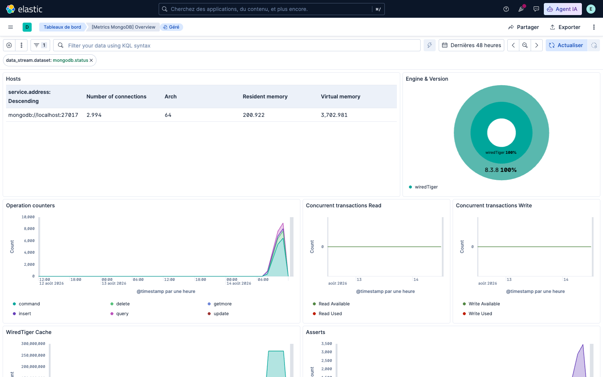

### Hosts

Ce tableau identifie l’instance MongoDB observée et synthétise le nombre de connexions, l’architecture ainsi que les volumes de mémoire résidente et virtuelle.

Dans le déploiement Fleet actuel, le champ d'identité recommandé est
`host.name`, dont la valeur est `mongodb-01`. Le champ `service.address` vaut
`mongodb://192.168.33.10:27017` et représente la cible de collecte, pas le nom
de l'hôte. Une visualisation affichant encore `localhost` doit donc utiliser
`host.name` à la place de `service.address` pour sa colonne serveur.

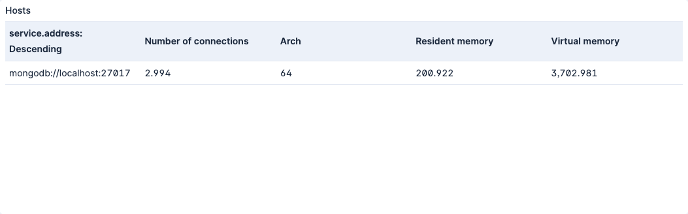

### Engine & Version

Cette visualisation présente la répartition des instances par moteur de stockage et par version. Dans l’environnement capturé, MongoDB utilise **WiredTiger** en version **8.3.8**.

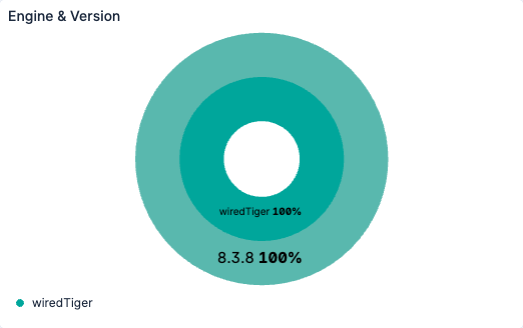

### Operation counters

Cette courbe empilée représente l’évolution des compteurs d’opérations MongoDB : commandes, insertions, requêtes, mises à jour, suppressions et opérations `getMore`. Elle met en évidence les périodes de forte activité.

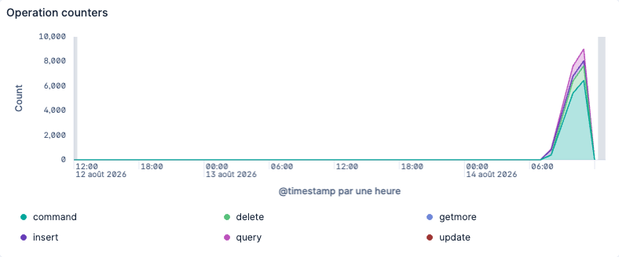

### Concurrent transactions Read

Ce widget compare les tickets de lecture WiredTiger disponibles et utilisés. Une baisse durable de la capacité disponible peut signaler une contention sur les lectures.

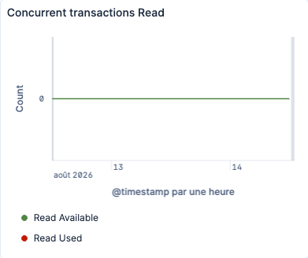

### Concurrent transactions Write

Ce widget compare les tickets d’écriture WiredTiger disponibles et utilisés. Il aide à détecter une saturation ou une contention lors des écritures concurrentes.

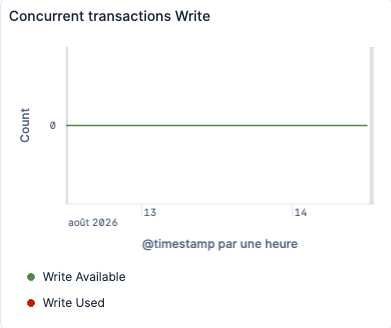

### WiredTiger Cache

Cette courbe suit la taille maximale du cache WiredTiger, son occupation et le volume de données modifiées (« dirty »). Elle permet de repérer une pression mémoire ou un retard de vidage vers le stockage.

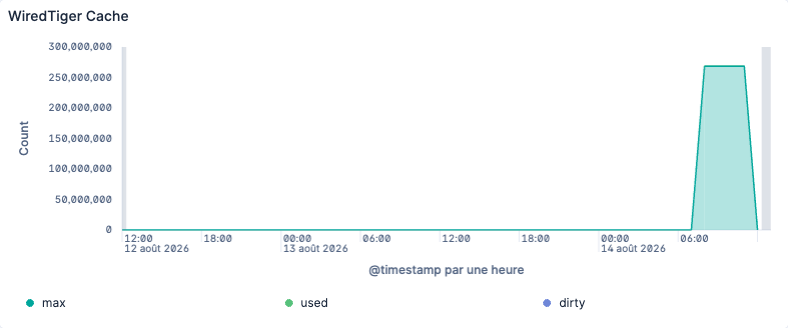

### Asserts

Cette visualisation suit les assertions MongoDB par catégorie : régulières, utilisateur, message, avertissement et rollover. Une hausse soudaine constitue un signal à corréler avec les logs.

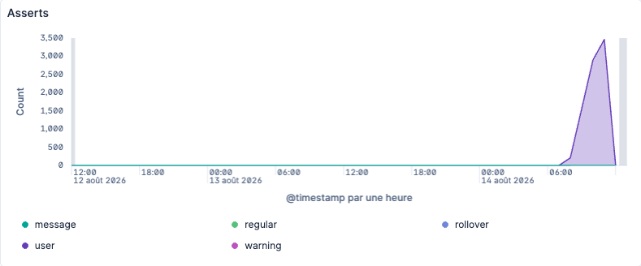

### Memory stats

Ce widget présente l’évolution de la mémoire MongoDB : mémoire résidente, virtuelle, mappée et mappée avec journal. Il sert à suivre l’empreinte mémoire du processus et ses variations dans le temps.

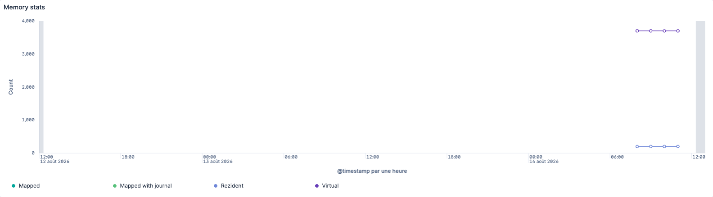

## Dashboard Logs MongoDB

Le dashboard **[Logs MongoDB] Overview** exploite le jeu de données `mongodb.log`. Il fournit une vue synthétique des niveaux de sévérité et donne accès aux événements détaillés utiles au diagnostic.

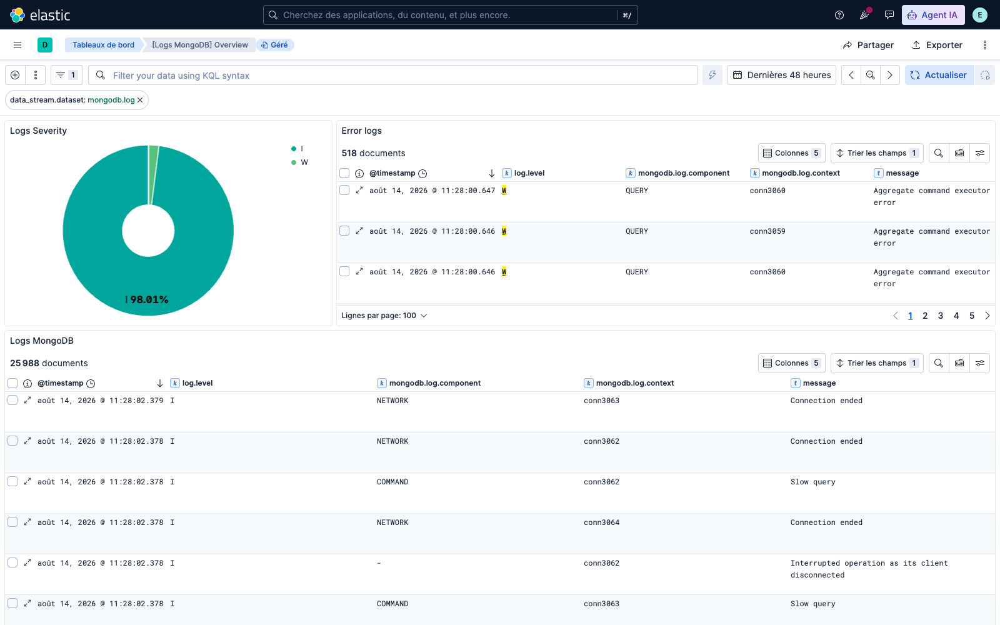

### Logs Severity

Ce diagramme répartit les événements par niveau de journalisation. La capture montre une très large majorité de messages informatifs (`I`) et une faible proportion d’avertissements (`W`).

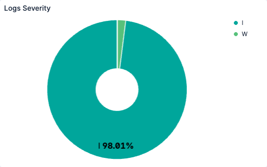

### Error logs

Ce tableau isole les événements considérés comme erreurs et affiche leur date, leur niveau, le composant MongoDB, le contexte de connexion et le message. Il permet de passer rapidement d’une alerte à son contexte technique.

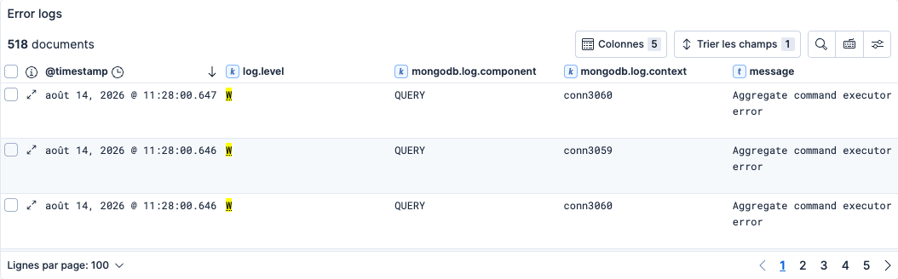

### Logs MongoDB

Ce tableau rassemble tous les événements MongoDB. Les champs visibles permettent notamment de distinguer les événements réseau, les commandes, les requêtes lentes et les interruptions de connexion.

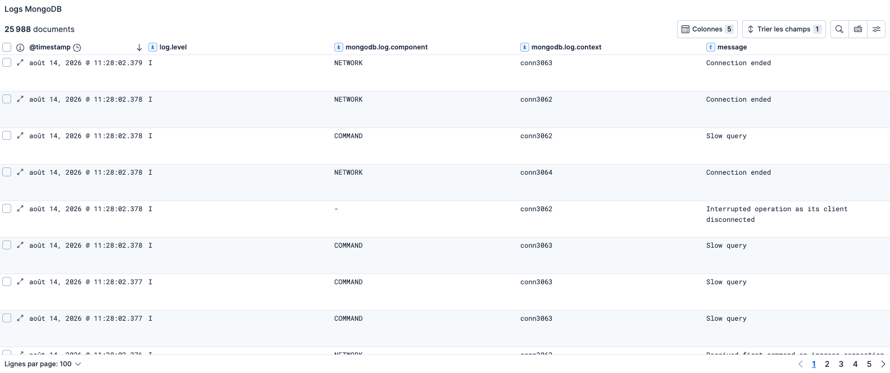

## Lecture croisée recommandée

Lorsqu’une anomalie apparaît dans les métriques, la démarche conseillée est de :

1. repérer sa période dans **Operation counters**, **WiredTiger Cache**, **Memory stats** ou les transactions concurrentes ;
2. consulter **Logs Severity** sur la même période ;
3. rechercher le détail dans **Error logs** puis dans **Logs MongoDB** ;
4. corréler le message avec le composant et le contexte de connexion concernés.

Pour limiter les dashboards à la VM gérée par Fleet, ajouter le filtre KQL :

```text
host.name: "mongodb-01"
```

Pour isoler le trafic généré par le workload du POC :

```text
host.name: "mongodb-01" and mongodb.log.attr.ns: observability_test*
```
