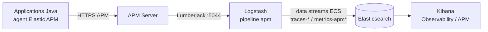
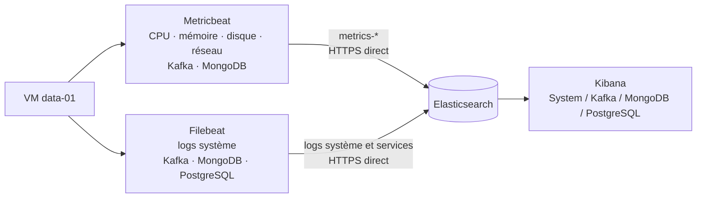
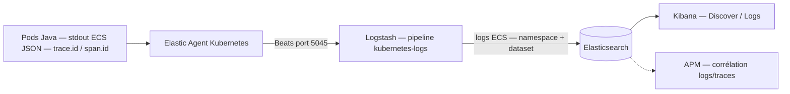
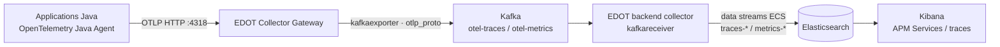
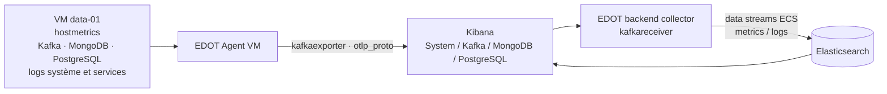
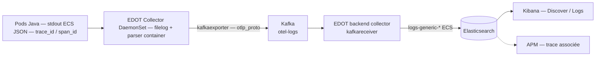

# Schémas de remontée de l'observabilité v1/v2

Ces schémas décrivent les flux déclarés dans le dépôt pour le profil léger,
avec la VM `data-01`. Les flèches indiquent le transport et les data streams
indiquent la destination logique dans Elasticsearch.

## v1 — métriques et traces APM Java

Références Elastic : [agent APM Java](https://www.elastic.co/docs/reference/apm/agents/java)
et [sortie APM Server vers Logstash](https://www.elastic.co/docs/solutions/observability/apm/configure-logstash-output).

## v1 — métriques et logs de la VM

`Metricbeat` collecte les métriques système, Kafka et MongoDB. `Filebeat`
collecte les logs système, Kafka, MongoDB et PostgreSQL. Les deux agents
écrivent directement dans Elasticsearch en v1 ; Kafka est une source observée,
pas un buffer de télémétrie.

Références Elastic : [Metricbeat](https://www.elastic.co/docs/reference/beats/metricbeat/),
[module System](https://www.elastic.co/guide/en/beats/metricbeat/current/metricbeat-module-system.html)
et [Filebeat](https://www.elastic.co/docs/reference/beats/filebeat/).

## v1 — logs applicatifs

Références Elastic : [Filebeat sur Kubernetes](https://www.elastic.co/docs/reference/beats/filebeat/running-on-kubernetes)
et [sortie Logstash d'Elastic Agent](https://www.elastic.co/docs/reference/fleet/logstash-output).

## v2 — métriques et traces APM Java

Le `elasticapm` processor/connector produit les métriques APM agrégées à
partir des traces ; elles suivent le même buffer Kafka avant indexation.

Références Elastic : [agent EDOT Java](https://www.elastic.co/docs/reference/opentelemetry/edot-sdks/java/setup),
[architecture OpenTelemetry](https://www.elastic.co/docs/reference/opentelemetry/architecture)
et [pipeline Kafka OTLP](https://www.elastic.co/docs/reference/opentelemetry/architecture/kafka).

## v2 — métriques et logs de la VM

Le chemin VM v2 est volontairement distinct du Gateway : `EDOT Agent VM →
Kafka → EDOT Kafka exporter → Elasticsearch`. Le Collector backend exporte en
mapping ECS afin que les dashboards classiques puissent exploiter les champs
attendus (`service.name`, `trace.id`, `span.id`, `host.name`, etc.).

Références Elastic : [architecture des hôtes et VM](https://www.elastic.co/docs/reference/opentelemetry/architecture),
[receiver hostmetrics](https://www.elastic.co/docs/reference/edot-collector/components/hostmetricsreceiver)
et [pipeline Kafka OTLP](https://www.elastic.co/docs/reference/opentelemetry/architecture/kafka).

## v2 — logs applicatifs

Les applications Java n'exportent pas les logs via l'agent OpenTelemetry
(`OTEL_LOGS_EXPORTER=none`) : le DaemonSet lit stdout, normalise
`trace_id`/`span_id` vers `trace.id`/`span.id` et conserve le contexte de trace
dans les événements ECS indexés.

Références Elastic : [receiver filelog](https://www.elastic.co/docs/reference/edot-collector/components/filelogreceiver),
[configuration Kubernetes EDOT](https://www.elastic.co/docs/reference/edot-collector/config/default-config-k8s)
et [pipeline Kafka OTLP](https://www.elastic.co/docs/reference/opentelemetry/architecture/kafka).

## Ce qui manquait dans la liste initiale

Les trois familles citées couvrent les flux principaux. Pour une chaîne
complète, il faut également expliciter :

- les métriques et logs de la plateforme Kubernetes elle-même : métriques
  kubelet et état Kubernetes via Elastic Agent et `kube-state-metrics` en v1 ;
  métriques hôte et logs de pods via le DaemonSet EDOT en v2. La collecte v2 ne
  déclare pas actuellement de receiver `kubeletstats`, `k8s_cluster` ou
  `kube-state-metrics` ; elle ne couvre donc pas l'état complet du cluster ;
- la corrélation logs-traces (`trace.id`, `span.id`) et la génération des
  métriques APM agrégées depuis les traces ;
- le rôle de Kafka en v2 comme buffer de télémétrie, avec ses topics, ses
  consumer groups et l'EDOT exporter ;
- la consultation finale : data streams Elasticsearch, règles de routage et
  dashboards Kibana.

Référence Elastic : [architecture de référence OpenTelemetry](https://www.elastic.co/docs/reference/opentelemetry/architecture).

Les métriques Prometheus de l'application (`/actuator/prometheus`) constituent
un cas à part : elles sont exportées comme métriques OTel par l'agent Java en
v2 ; en v1, elles passent par la collecte Elastic Agent/Metricbeat dédiée.
Elles ne doivent pas être confondues avec les métriques APM agrégées.

Références Elastic : [intégration Prometheus](https://www.elastic.co/docs/reference/integrations/prometheus),
[collecte des métriques EDOT](https://www.elastic.co/docs/reference/edot-collector/config/configure-metrics-collection)
et [connecteur APM](https://www.elastic.co/docs/reference/edot-collector/components/elasticapmconnector).

## Sources IaC

- v1 : `v1/platform/kubernetes/base/observability/` et
  `v1/ansible/templates/filebeat.yml.j2`, `metricbeat.yml.j2` ;
- v2 : `v2/platform/kubernetes/base/observability/otel-kafka.yaml` et
  `v2/ansible/templates/otel-agent.yml.j2` ;
- vue de référence lisible directement sur GitHub : ce document Markdown et ses
  six schémas Mermaid.
