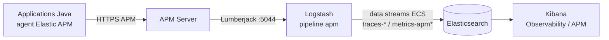
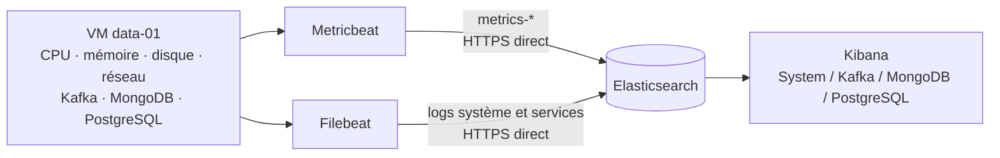
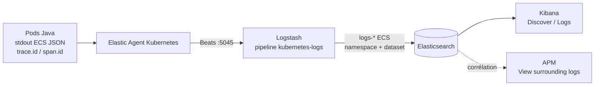
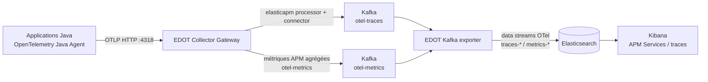
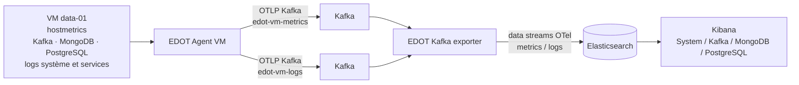

# Schémas de remontée de l'observabilité v1/v2

Ces schémas décrivent les flux déclarés dans le dépôt pour le profil léger,
avec la VM `data-01`. Les flèches indiquent le transport et les data streams
indiquent la destination logique dans Elasticsearch.

## v1 — métriques et traces APM Java



## v1 — métriques et logs de la VM



`Metricbeat` et `Filebeat` des VM écrivent directement dans Elasticsearch en
v1 ; Kafka est une source observée, pas un buffer de télémétrie.

## v1 — logs applicatifs



## v2 — métriques et traces APM Java



Le `elasticapm` processor/connector produit les métriques APM agrégées à
partir des traces ; elles suivent le même buffer Kafka avant indexation.

## v2 — métriques et logs de la VM



Le chemin VM v2 est volontairement distinct du Gateway : `EDOT Agent VM →
Kafka → EDOT Kafka exporter → Elasticsearch`.

## v2 — logs applicatifs

```mermaid
flowchart LR
    P[Pods Java\nstdout ECS JSON\ntrace_id / span_id] --> D[EDOT Collector DaemonSet\nfilelog + parser container]
    D -->|OTLP Kafka\notel-logs| L[Kafka]
    L --> X[EDOT Kafka exporter]
    X -->|logs-generic.otel-*| E[(Elasticsearch)]
    E --> K[Kibana\nDiscover / Logs]
    E -. trace.id .-> AP[APM\ntrace associée]
```

Les applications Java n'exportent pas les logs via l'agent OpenTelemetry
(`OTEL_LOGS_EXPORTER=none`) : le DaemonSet lit stdout et conserve le contexte
de trace dans les événements indexés.

## Ce qui manquait dans la liste initiale

Les trois familles citées couvrent les flux principaux. Pour une chaîne
complète, il faut également expliciter :

- les métriques et logs de la plateforme Kubernetes elle-même (DaemonSet
  EDOT en v2, Elastic Agent et `kube-state-metrics` en v1) ;
- la corrélation logs-traces (`trace.id`, `span.id`) et la génération des
  métriques APM agrégées depuis les traces ;
- le rôle de Kafka en v2 comme buffer de télémétrie, avec ses topics, ses
  consumer groups et l'EDOT exporter ;
- la consultation finale : data streams Elasticsearch, règles de routage et
  dashboards Kibana.

Les métriques Prometheus de l'application (`/actuator/prometheus`) constituent
un cas à part : elles sont exportées comme métriques OTel par l'agent Java en
v2 ; en v1, elles passent par la collecte Elastic Agent/Metricbeat dédiée.
Elles ne doivent pas être confondues avec les métriques APM agrégées.

## Sources IaC

- v1 : `v1/platform/kubernetes/base/observability/` et
  `v1/ansible/templates/filebeat.yml.j2`, `metricbeat.yml.j2` ;
- v2 : `v2/platform/kubernetes/base/observability/otel-kafka.yaml` et
  `v2/ansible/templates/otel-agent.yml.j2` ;
- vue de référence lisible directement sur GitHub : ce document Markdown et ses
  six schémas Mermaid.
